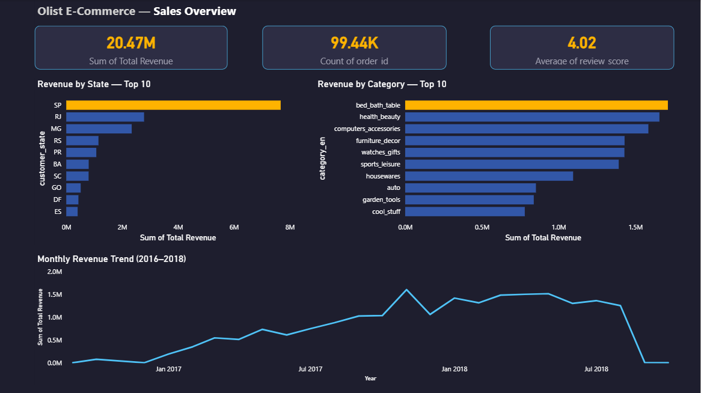
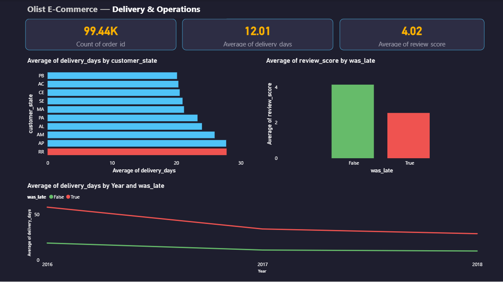
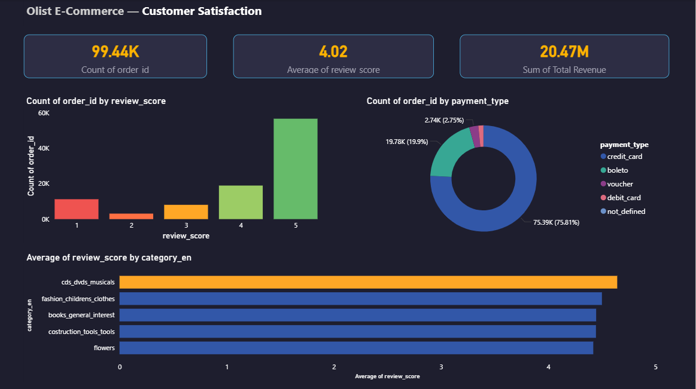

# 🛒 E-Commerce Sales & Customer Behaviour Analysis
### Olist Brazil Dataset | Python • SQL • Power BI

---

## 📌 Project Overview

Analysed 100,000+ real e-commerce transactions from Olist, Brazil's largest 
online marketplace, to uncover revenue patterns, operational inefficiencies, 
and customer satisfaction drivers. Findings were translated into actionable 
business recommendations across sales, logistics, and seller management.

**Tools:** Python (Pandas, NumPy, Matplotlib, Seaborn) • SQL (SQLite) • Power BI  
**Dataset:** [Olist Brazilian E-Commerce Dataset](https://www.kaggle.com/datasets/olistbr/brazilian-ecommerce) — 99,441 orders | Sept 2016 – Oct 2018

> ⚠️ Dataset files are not included due to size limits. Download directly from Kaggle link above and run `01_data_cleaning.ipynb` to generate the master dataset.

---

## 🎯 Business Questions Answered

1. Which months, states, and categories drive the most revenue?
2. How do delivery times vary across Brazil — and who is being underserved?
3. Does late delivery directly impact customer satisfaction scores?
4. When do customers buy, and how do they pay?
5. Which sellers are damaging platform reputation?

---

## 🔑 Key Findings

| # | Finding | Business Impact |
|---|---------|-----------------|
| 1 | November 2017 recorded peak revenue of **R$1.6M** | 55% spike vs October — driven by Black Friday |
| 2 | São Paulo contributes **42.7% of total revenue** | Top 3 states (SP, RJ, MG) = 71.2% combined |
| 3 | Bed & bath is top category at **R$1.71M** | But scores lowest satisfaction (3.90/5) among top 10 |
| 4 | Delivery ranges from **8.3 days (SP) to 28 days (RR)** | 3.4x gap exposing severe logistics inequality |
| 5 | Late orders score **2.55/5 vs 4.21/5** on-time | 1.67 star drop — 52.2% of late orders get 1-star |
| 6 | Peak buying: **Monday at 4PM** | Weekdays = 76% of all orders |
| 7 | Credit card = **75.8% of payments** | Avg 3.7 installments per order |
| 8 | **7 sellers** (1.1%) score below 3.0 avg | One seller alone has 321 one-star reviews |

---

## 📁 Project Structure
```
olist-ecommerce-analysis/
├── data/
│   └── README.md                 # Download instructions for dataset
├── notebooks/
│   ├── 01_data_cleaning.ipynb    # Data merging, null handling, feature engineering
│   ├── 02_eda.ipynb              # 8 business findings with visualisations
│   └── 03_sql_analysis.ipynb    # 5 SQL queries for business questions
├── dashboard/
│   ├── olist_dashboard.pbix      # 3-page Power BI dashboard
│   ├── page1_sales_overview.png
│   ├── page2_delivery_operations.png
│   └── page3_customer_satisfaction.png
└── README.md
```

---

## 🔧 Technical Highlights

- Merged **9 relational tables** into a 113k-row master dataset using Pandas
- Engineered `delivery_days` and `was_late` flags to enable delay-to-satisfaction analysis
- Removed **814 duplicate reviews** and handled nulls across all tables with documented decisions
- Loaded CSV into **SQLite** and wrote 5 business-focused SQL queries
- Built a **3-page Power BI dashboard** with dark theme, KPI cards, and conditional formatting

---

## 💡 Business Recommendations

1. **Fix logistics in the North/Northeast** — RR, AP, AM customers wait 3x longer than SP. Partner with regional carriers to reduce delivery inequality.
2. **Flag and audit underperforming sellers** — 7 sellers with <3.0 avg score handle hundreds of orders. Implement seller scorecards with automatic review triggers.
3. **Capitalise on Black Friday** — November 2017 showed a 55% revenue spike. Plan inventory, logistics capacity, and marketing campaigns 6 weeks in advance.
4. **Protect credit card instalment options** — 75.8% of customers pay by credit card with avg 3.7 installments. Any change to payment terms risks significant churn.
5. **Improve bed & bath category experience** — Highest revenue but lowest satisfaction. Investigate product quality, packaging, and delivery handling for this category.

---

## 📊 Dashboard Preview

**Page 1 — Sales Overview**


**Page 2 — Delivery & Operations**


**Page 3 — Customer Satisfaction**


---

## 👩‍💻 Author

**Lasya Manchikalapudi**  
Final-year CS student | Aspiring Data Analyst  
[LinkedIn]((https://www.linkedin.com/in/lasyamanchikalapudi/)) • [GitHub](https://github.com/lasyamanchikalapudi)
